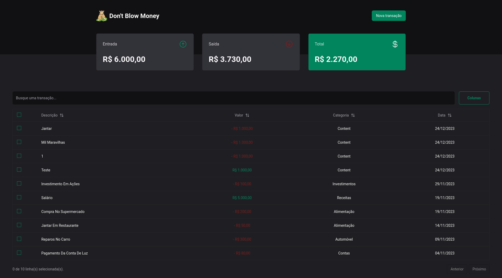
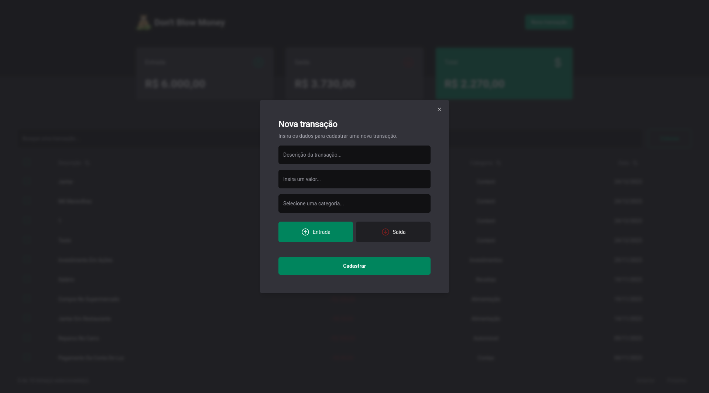

# Don't Blow Money

## Sobre o projeto

O Dont Blow Money é um aplicativo web que ajuda os usuários a controlarem seus gastos. O aplicativo permite que os usuários criem categorias de gastos, registrem suas despesas e visualizem seu orçamento.

### HOME PAGE



### NEW TRANSACTION DIALOG



## Tecnologias usadas

- JSON-Server: para simular uma API
- Next.js: framework React
- TailwindCSS: para estilização
- Shadcn/ui: para temas e componentes visuais com radix
- Tanstack/table: para controle da tabela
- React Hook Form: para controle dos dados dos formulários
- Zod: para validação dos campos do formulário

## Instalação

Para instalar o projeto, siga estas etapas:

Clone o repositório:

```bash
git clone https://github.com/gildembergleite/dont-blow-money.git
```

Instale as dependências:

```bash
npm install
```

Inicie o servidor:

```bash
npm run server
```

Em outro terminal inicie a aplicação:

```bash
npm run dev
```

## Uso

Para usar o projeto, acesse o seguinte endereço no seu navegador:

http://localhost:3000

## Contribuições

Contribuições são bem-vindas. Para contribuir, siga estas etapas:

Faça um fork do repositório.
Faça suas alterações e teste-as.
Envie um pull request.

## Licença

O projeto é licenciado sob a licença MIT.
